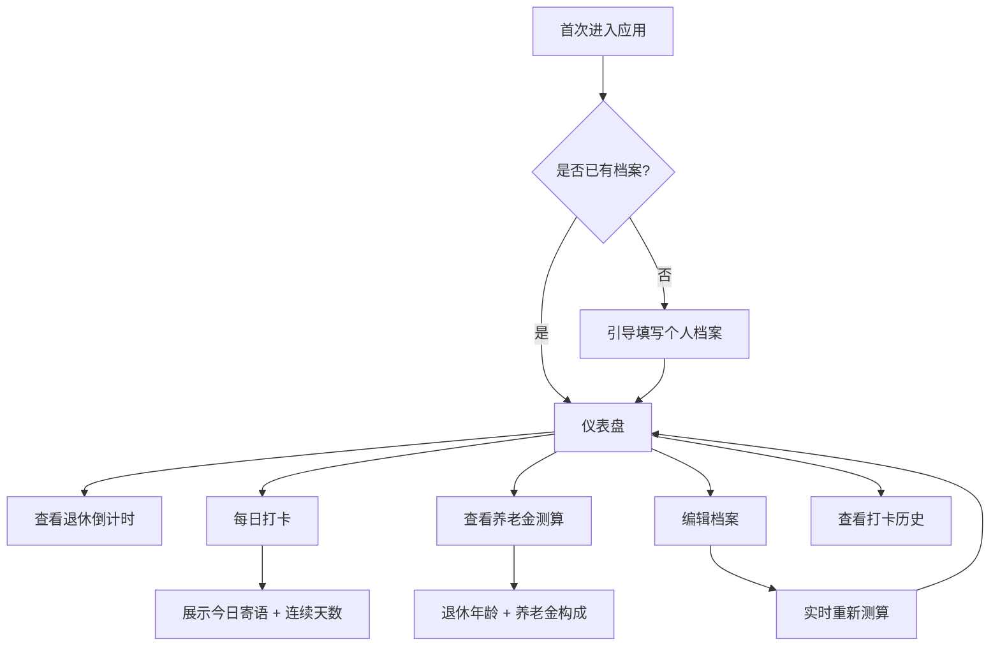

# 退了没 - 产品需求文档（PRD）

## 1. 产品概述

「退了没」是一款面向中国职场人群的退休进度追踪与养老金测算应用。用户每日登录打卡，绑定个人信息（出生年月、性别、地区、工资、缴费年限等），应用基于 2025 年渐进式延迟退休政策与城镇职工基本养老保险计发办法，实时测算法定退休年龄、距离退休的剩余时间、以及退休后每月可领取的养老金金额，帮助用户把"退休"这件遥远的事变成可量化、可追踪的日常仪式。

- **目标用户**：25–55 岁在职职工，关心退休时间与养老保障的职场人
- **核心价值**：把模糊的"退休"变成清晰的倒计时与可读的数字，缓解养老焦虑

## 2. 核心功能

### 2.1 用户角色

| 角色 | 注册方式 | 核心权限 |
|------|----------|----------|
| 普通用户 | 本地账号（首次进入自动建档） | 打卡、填写档案、查看测算结果、查看历史记录 |

### 2.2 功能模块

1. **仪表盘（首页）**：每日打卡、退休倒计时、关键指标卡片、今日寄语
2. **个人档案**：基础信息与缴费信息录入与编辑
3. **退休测算**：法定退休年龄、剩余时间、养老金构成的可视化结果
4. **打卡历史**：打卡日历、档案变更记录、测算结果趋势

### 2.3 页面详情

| 页面名称 | 模块名称 | 功能描述 |
|----------|----------|----------|
| 仪表盘 | 退休倒计时 | 大字号显示距离退休的年/月/天，配进度环 |
| 仪表盘 | 每日打卡 | 当日打卡按钮，打卡后展示今日寄语与连续天数 |
| 仪表盘 | 关键指标卡 | 法定退休年龄、预计退休日期、预估月养老金、缴费进度 |
| 仪表盘 | 退休进度轴 | 从入职到退休的时间轴可视化 |
| 个人档案 | 基础信息 | 出生年月、性别、身份（干部/工人）、所在省份、参加工作时间 |
| 个人档案 | 缴费信息 | 当前月工资、历年缴费指数、个人账户累计余额、已缴费年限 |
| 个人档案 | 政策参数 | 社平工资、计发月数等可调参数（带默认值） |
| 退休测算 | 退休年龄测算 | 依据 2025 延迟退休政策计算法定退休年龄与日期 |
| 退休测算 | 养老金构成 | 基础养老金 + 个人账户养老金 + 过渡性养老金 三部分拆解 |
| 退休测算 | 测算说明 | 公式与政策依据的折叠说明 |
| 打卡历史 | 打卡日历 | 月历视图，已打卡日期高亮 |
| 打卡历史 | 变更记录 | 档案修改与测算结果的时间线 |

## 3. 核心流程

用户首次进入应用 → 引导填写个人档案（基础信息 + 缴费信息）→ 系统依据政策与公式测算 → 跳转仪表盘展示倒计时与养老金 → 用户每日打卡积累连续天数 → 修改档案后实时重算 → 历史页查看打卡与变更记录。

## 4. 用户界面设计

### 4.1 设计风格

**美学方向：现代年鉴体（Modern Almanac）** —— 像一本精心装帧的财务年鉴/老黄历，温暖、可信、有仪式感，同时配以精确的数据可视化。

- **主色**：暖纸色背景 `#F4EFE3`，墨黑正文 `#1C1A17`
- **强调色**：印章红 `#B23A2E`（用于关键标记/打卡），琥珀金 `#C8893B`（用于进度与高亮）
- **辅助色**：青灰 `#5B6B6A`（次要信息），米白卡片 `#FBF8F0`
- **按钮风格**：方形微圆角（2px），印章式按压反馈，主按钮用印章红
- **字体**：标题用 Fraunces（有性格的衬线体），正文用 Spectral，数字与代码用 JetBrains Mono
- **布局**：桌面端多栏编辑式版面，不对称网格，卡片带细边框与轻微纸纹阴影
- **图标/装饰**：印章、邮戳、日历格、时间轴等年鉴意象，避免通用 emoji

### 4.2 页面设计概览

| 页面名称 | 模块名称 | UI 元素 |
|----------|----------|----------|
| 仪表盘 | 退休倒计时 | 超大衬线数字、环形进度、琥珀金描边 |
| 仪表盘 | 每日打卡 | 印章红圆形按钮，打卡后盖"已打卡"邮戳动画 |
| 仪表盘 | 关键指标卡 | 米白卡片、细边框、等宽数字、底部细分割线 |
| 仪表盘 | 退休进度轴 | 横向时间轴，节点为邮戳样式 |
| 个人档案 | 表单 | 分组卡片、衬线标签、下划线输入框、省份下拉 |
| 退休测算 | 养老金构成 | 堆叠条形图 + 三栏数字拆解 |
| 退休测算 | 测算说明 | 折叠面板，展开显示公式 |
| 打卡历史 | 打卡日历 | 月历网格，已打卡日盖红印 |

### 4.3 响应式

桌面优先（多栏编辑式布局），平板/移动端自适应为单栏堆叠，打卡按钮与倒计时在移动端保持视觉优先级，触摸目标 ≥ 44px。

### 4.4 3D 场景

不适用。
