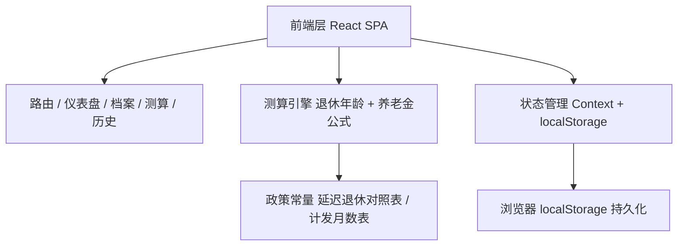
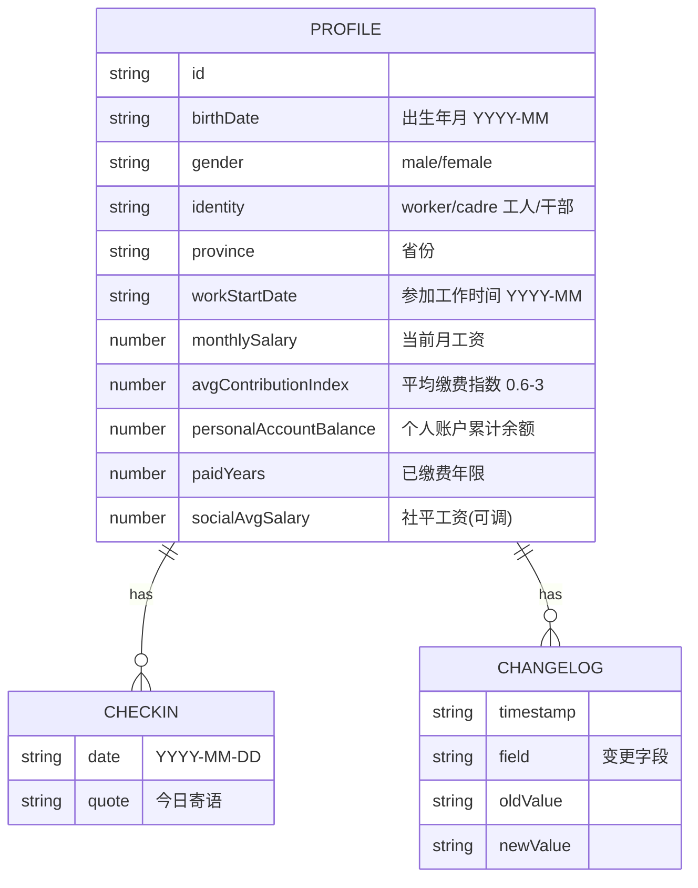

# 退了没 - 技术架构文档

## 1. 架构设计

纯前端单页应用，所有测算逻辑在前端完成，用户数据持久化于浏览器 localStorage，无需后端服务。



## 2. 技术说明

- **前端**：React@18 + tailwindcss@3 + vite
- **初始化工具**：vite-init（react-ts 模板）
- **后端**：无（纯前端，localStorage 持久化）
- **数据库**：无（localStorage 模拟）
- **图表**：自研 SVG/CSS 可视化（堆叠条形图、环形进度、时间轴），不引入重型图表库
- **字体**：Fraunces、Spectral、JetBrains Mono（Google Fonts）

## 3. 路由定义

| 路由 | 用途 |
|------|------|
| `/` | 仪表盘：倒计时、打卡、关键指标、进度轴 |
| `/profile` | 个人档案：基础信息与缴费信息录入 |
| `/calc` | 退休测算：退休年龄与养老金构成 |
| `/history` | 打卡历史：打卡日历与变更记录 |

## 4. API 定义

无后端 API。前端通过 `useProfile` / `useCheckin` 等 Context Hook 读写 localStorage。

## 5. 服务端架构

不适用。

## 6. 数据模型

### 6.1 数据模型定义



### 6.2 数据定义语言

localStorage 键值结构（JSON）：

```json
{
  "tuilemei_profile": {
    "birthDate": "1985-06",
    "gender": "male",
    "identity": "worker",
    "province": "北京",
    "workStartDate": "2007-07",
    "monthlySalary": 15000,
    "avgContributionIndex": 1.2,
    "personalAccountBalance": 86000,
    "paidYears": 18,
    "socialAvgSalary": 12183
  },
  "tuilemei_checkins": {
    "2026-06-23": { "quote": "今日已打卡，离自由又近一天。" }
  },
  "tuilemei_changelog": [
    { "timestamp": "2026-06-23T10:00:00Z", "field": "monthlySalary", "oldValue": "14000", "newValue": "15000" }
  ]
}
```

### 6.3 测算引擎核心算法

**法定退休年龄（2025 渐进式延迟退休）**：
- 男职工：60 → 63，每 4 个月延迟 1 个月
- 女工人：50 → 55，每 2 个月延迟 1 个月
- 女干部：55 → 58，每 4 个月延迟 1 个月
- 依据出生年月查表得出法定退休年龄（精确到月）

**养老金计发（城镇职工基本养老保险）**：
- 基础养老金 = (社平工资 + 本人指数化月平均缴费工资) / 2 × 缴费年限 × 1%
  - 本人指数化月平均缴费工资 = 社平工资 × 平均缴费指数
- 个人账户养老金 = 个人账户累计余额 / 计发月数
  - 计发月数：60岁=139，55岁=170，50岁=195（按退休年龄查表）
- 过渡性养老金：视同缴费年限 × 社平工资 × 平均缴费指数 × 系数（简化处理）
- 月养老金合计 = 基础养老金 + 个人账户养老金 + 过渡性养老金
